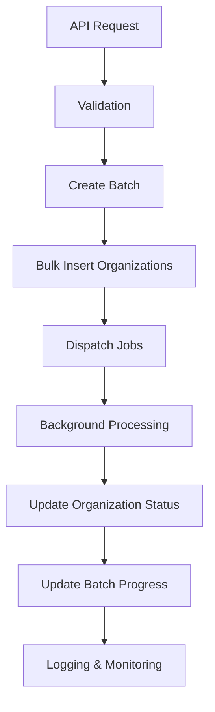

# Laravel Bulk Organization Onboarding API

A high-performance Laravel 12 API for bulk organization onboarding with background job processing, idempotency, and comprehensive testing.

## 🚀 Overview

This application provides a scalable solution for bulk onboarding organizations through a RESTful API endpoint. It handles high-throughput requests (10 req/sec) with efficient background processing, ensuring data consistency and reliability.

## ✨ Features

- **High-Performance API**: Handles up to 1000 organizations per request
- **Background Job Processing**: Asynchronous processing with Redis queues
- **Idempotent Operations**: Prevents duplicate processing and ensures consistency
- **Retry & Backoff**: Automatic retry mechanism with exponential backoff
- **Comprehensive Testing**: Feature and unit tests with 80%+ coverage
- **Structured Logging**: Detailed logging with batch and organization tracking
- **CI/CD Pipeline**: Automated testing, security scanning, and deployment
- **Database Optimization**: Bulk inserts with chunking and duplicate handling

## 📋 Requirements

- PHP 8.2+
- MySQL 8.0+ or PostgreSQL 12+
- Redis 7+
- Composer 2.0+
- Laravel 12

## 🛠️ Installation

```bash
# Clone the repository
git clone <repository-url>
cd laravel_assesment

# Install dependencies
composer install

# Environment setup
cp .env.example .env
php artisan key:generate

# Database setup
php artisan migrate

# Start Redis server
redis-server

# Start queue worker
php artisan queue:work --queue=organization-onboarding

# Start development server
php artisan serve
```

## 🔧 Configuration

### Environment Variables

```env
# Database
DB_CONNECTION=mysql
DB_HOST=127.0.0.1
DB_PORT=3306
DB_DATABASE=laravel_bulk_onboarding
DB_USERNAME=root
DB_PASSWORD=

# Redis Queue
QUEUE_CONNECTION=redis
REDIS_HOST=127.0.0.1
REDIS_PASSWORD=null
REDIS_PORT=6379

# Application
APP_ENV=local
APP_DEBUG=true
APP_URL=http://localhost:8000
```

### Queue Configuration

```bash
# Start queue worker with monitoring
php artisan queue:work --queue=organization-onboarding --timeout=300

# Monitor failed jobs
php artisan queue:failed

# Retry failed jobs
php artisan queue:retry all
```

## 📚 API Documentation

### Bulk Onboarding Endpoint

**POST** `/api/bulk-onboard`

Accepts an array of organization objects for bulk onboarding.

#### Request Body

```json
[
  {
    "name": "Acme Corporation",
    "domain": "acme.com",
    "contact_email": "admin@acme.com"
  },
  {
    "name": "Tech Solutions",
    "domain": "techsolutions.io",
    "contact_email": "info@techsolutions.io"
  }
]
```

#### Response

```json
{
  "message": "Bulk onboarding initiated successfully",
  "batch_id": 12345,
  "total_organizations": 2,
  "status": "processing"
}
```

#### Validation Rules

- `name`: Required, max 255 characters
- `domain`: Required, max 255 characters, unique
- `contact_email`: Optional, valid email format
- Maximum 1000 organizations per request

#### HTTP Status Codes

- `202 Accepted`: Request accepted for processing
- `422 Unprocessable Entity`: Validation errors
- `500 Internal Server Error`: Server errors

## 🏗️ Architecture

### Database Schema

#### Organizations Table
- `id`: Primary key
- `name`: Organization name
- `domain`: Unique domain identifier
- `contact_email`: Optional contact email
- `status`: Enum (pending, processing, completed, failed)
- `batch_id`: Foreign key to batches table
- `processed_at`: Timestamp when processing completed
- `failed_reason`: Reason for failure
- `timestamps`: Created and updated timestamps

#### Batches Table
- `id`: Primary key
- `status`: Enum (pending, processing, completed, failed)
- `total_organizations`: Total organizations in batch
- `processed_organizations`: Successfully processed count
- `timestamps`: Created and updated timestamps

### Application Layers

1. **Controller Layer**: `BulkOnboardController`
   - Handles HTTP requests and responses
   - Input validation via `BulkOnboardRequest`

2. **Service Layer**: `BulkOnboardService`
   - Business logic orchestration
   - Transaction management
   - Job dispatch coordination

3. **Repository Layer**: `OrganizationRepository`
   - Database operations abstraction
   - Bulk insert optimization
   - Data access methods

4. **Job Layer**: `ProcessOrganizationOnboarding`
   - Asynchronous processing
   - Idempotency handling
   - Retry and failure management

## 🔄 Processing Flow



## 🧪 Testing

### Running Tests

```bash
# Run all tests
php artisan test

# Run feature tests
php artisan test --testsuite=Feature

# Run unit tests
php artisan test --testsuite=Unit

# Run with coverage
php artisan test --coverage

# Run specific test
php artisan test tests/Feature/BulkOnboardApiTest.php
```

### Test Coverage

- **Feature Tests**: API endpoint validation, error handling, performance
- **Unit Tests**: Job idempotency, success/failure scenarios, logging
- **Coverage**: 80%+ code coverage target

### Test Scenarios

- ✅ Valid bulk onboarding requests
- ✅ Validation error handling
- ✅ Duplicate domain prevention
- ✅ Rate limiting (1000 organizations max)
- ✅ Performance under load
- ✅ Job idempotency
- ✅ Retry and failure mechanisms
- ✅ Structured logging

## 📊 Performance Considerations

### Throughput Optimization

- **Bulk Inserts**: Chunked inserts (500 records per chunk)
- **Queue Processing**: Redis-based job queues
- **Database Indexing**: Optimized indexes on domain and batch_id
- **Connection Pooling**: Efficient database connections

### Scalability Features

- **Horizontal Scaling**: Multiple queue workers
- **Database Sharding**: Batch-based data distribution
- **Caching**: Redis for session and cache storage
- **Load Balancing**: API endpoint distribution

### Monitoring Metrics

- Request response times
- Queue depth and processing times
- Database query performance
- Error rates and failure patterns

## 🔒 Security Considerations

### Input Validation
- Request size limits
- Data type validation
- SQL injection prevention
- XSS protection

### Rate Limiting
- 1000 organizations per request
- IP-based throttling
- Authentication requirements (future enhancement)

### Data Protection
- Encrypted sensitive data
- Audit logging
- Access controls
- GDPR compliance considerations

## 🚀 Deployment

### CI/CD Pipeline

The application includes a comprehensive GitLab CI/CD pipeline:

#### Stages
1. **Test**: Automated testing with coverage
2. **Security**: Vulnerability scanning and audits
3. **Deploy**: Automated deployment to production

#### Pipeline Features
- Multi-PHP version testing
- Database integration testing
- Security vulnerability scanning
- Code quality analysis
- Automated deployment

### Environment Setup

#### Production Environment
```bash
# Production optimizations
composer install --no-dev --optimize-autoloader
php artisan config:cache
php artisan route:cache
php artisan view:cache

# Queue worker setup
php artisan queue:work --daemon --queue=organization-onboarding
```

#### Monitoring Setup
```bash
# Log monitoring
tail -f storage/logs/laravel.log

# Queue monitoring
php artisan queue:monitor

# Performance monitoring
php artisan about
```

## 🐛 Troubleshooting

### Common Issues

#### Queue Jobs Not Processing
```bash
# Check queue connection
php artisan queue:failed

# Restart queue worker
php artisan queue:restart

# Clear queue cache
php artisan queue:clear
```

#### Database Connection Issues
```bash
# Check database configuration
php artisan config:cache

# Test database connection
php artisan tinker
>>> DB::connection()->getPdo()
```

#### Performance Issues
```bash
# Check slow queries
php artisan db:show

# Monitor memory usage
php artisan about
```

### Debug Mode

Enable detailed logging:
```env
LOG_LEVEL=debug
APP_DEBUG=true
```

## 📈 Assumptions & Trade-offs

### Assumptions

1. **High Throughput Requirement**: System designed for 10 requests/second sustained load
2. **Reliable Network**: Stable connection between API and queue systems
3. **Database Performance**: MySQL/PostgreSQL can handle the expected load
4. **Redis Availability**: Redis queue system is highly available
5. **Email Delivery**: External email services are reliable for notifications

### Trade-offs

1. **Eventual Consistency**: Background processing means slight delay in status updates
2. **Memory Usage**: Bulk operations may consume significant memory during processing
3. **Queue Dependencies**: System reliability depends on queue infrastructure
4. **Complexity vs Performance**: Additional complexity for better performance characteristics

### Limitations

1. **Single Region**: Currently designed for single-region deployment
2. **Database Locking**: Bulk inserts may cause temporary table locks
3. **Error Recovery**: Manual intervention required for certain failure scenarios
4. **Monitoring**: Basic logging without advanced monitoring dashboard

## 🚀 Future Improvements

### Short-term Enhancements

1. **API Authentication**: Implement JWT or OAuth2 authentication
2. **Rate Limiting**: Advanced rate limiting with Redis
3. **Webhook Notifications**: Real-time status updates via webhooks
4. **Batch Status API**: Endpoint to check batch processing status
5. **Admin Dashboard**: Web interface for monitoring and management

### Medium-term Enhancements

1. **Multi-region Deployment**: Geographic distribution for better performance
2. **Database Optimization**: Read replicas and sharding strategies
3. **Advanced Monitoring**: Integration with APM tools (New Relic, DataDog)
4. **Caching Strategy**: Redis caching for frequently accessed data
5. **API Versioning**: Support for multiple API versions

### Long-term Enhancements

1. **Microservices Architecture**: Split into specialized services
2. **Event Sourcing**: Implement event-driven architecture
3. **Machine Learning**: Predictive failure analysis and optimization
4. **GraphQL API**: Alternative to REST API for flexible queries
5. **Real-time Processing**: WebSocket support for live updates

## 📝 Contributing

1. Fork the repository
2. Create a feature branch (`git checkout -b feature/amazing-feature`)
3. Commit your changes (`git commit -m 'Add amazing feature'`)
4. Push to the branch (`git push origin feature/amazing-feature`)
5. Open a Pull Request

### Development Guidelines

- Follow PSR-12 coding standards
- Write tests for new features
- Update documentation
- Ensure CI/CD pipeline passes

## 📄 License

This project is licensed under the MIT License - see the [LICENSE](LICENSE) file for details.

## 📞 Support

For questions and support:

- Create an issue in the repository
- Check the troubleshooting section
- Review the API documentation
- Monitor logs for detailed error information

---

**Built with ❤️ using Laravel 12**
